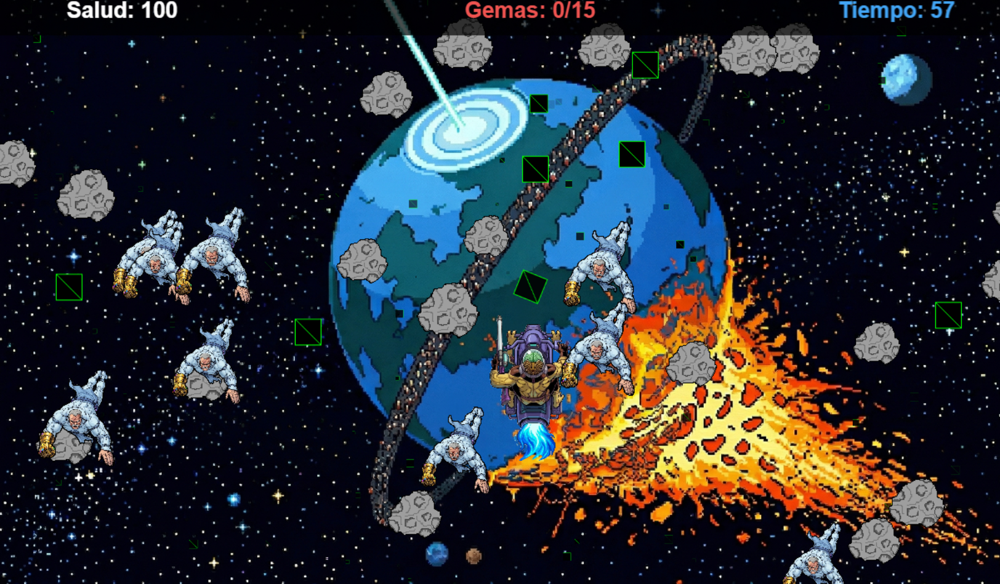

# GalaxyGem - Proyecto de Nave Espacial GAME!

¡Hola! Este es el repositorio de **GalaxyGem**, un juego de naves estilo arcade desarrollado en colaboración con un gran amigo. El objetivo de este proyecto fue poner a prueba nuestras habilidades de programación y diseño de videojuegos, trabajando codo con codo en un repositorio de GitHub para crear algo divertido desde cero.

## 🤝 Colaboración y Workflow!

Este proyecto no lo hice solo. Fue una experiencia increíble trabajar junto a un amigo usando **Git** y **GitHub**.

- **Repositorio compartido:** Centralizamos todo el código para poder editarlo simultáneamente.
- **Commits y Control de Versiones:** Fuimos subiendo nuestras mejoras paso a paso. Si uno arreglaba la lógica de los meteoritos, el otro podía estar trabajando en el ladeo de la nave o en los assets.
- **Resolución de conflictos:** Aprendimos a manejar el código juntos, asegurándonos de que cada cambio (¡por pequeño que fuera!) sumara al resultado final.

## Tecnologías Usadas

Para construir el juego, elegimos herramientas potentes pero accesibles:

- **Phaser CE (v2.9.2):** El motor principal. Lo elegimos por su robustez para juegos 2D y su excelente manejo de sprites y físicas.
- **JavaScript (Vanilla):** Toda la lógica del juego está escrita en JS puro, sin frameworks pesados, para que sea rápido y ligero.
- **HTML5 & CSS3:** Para la estructura básica y el contenedor donde vive nuestra galaxia.
- **GitHub:** Nuestra base de operaciones para la gestión del código.

## Lógica y Métodos del Juego

### 1. Sistema de "Reciclaje" (Object Pooling)

En lugar de crear y destruir miles de objetos (que consumiría mucha memoria), usamos una lógica de reciclaje.

- Los **meteoritos**, **estrellas** y **gemas** se crean una sola vez al inicio.
- Cuando un elemento sale por la parte de abajo de la pantalla, el código detecta su posición y lo "teletransporta" de nuevo arriba con nuevas coordenadas aleatorias. ¡Esto hace que el juego parezca infinito y sea muy eficiente!

### 2. Máquina de Estados

Seguimos el patrón clásico de Phaser:

- **`init`**: Preparamos los puntajes y la vida del jugador.
- **`preload`**: Cargamos todos los assets (imágenes de la carpeta `/assets`).
- **`create`**: Instanciamos los objetos, configuramos el fondo y los grupos de colisiones.
- **`update`**: Es el corazón del juego. Aquí se calcula el movimiento, las rotaciones y las colisiones en tiempo real.

### 3. Físicas y Colisiones

Implementamos un sistema de **Bounding Boxes** (Cajas de colisión):

- Cada objeto (nave, meteorito, gema) tiene una "caja" invisible a su alrededor.
- El juego revisa constantemente si estas cajas se solapan. Si chocas con un meteorito, la vida baja en proporción al tamaño del impacto. Si tocas una gema, ¡ganas puntos y recuperas un poco de salud!

### 4. Estética Dinámica

- **Efecto de Ladeo (Tilt):** Configuramos la nave para que no solo se mueva, sino que se incline suavemente al girar, dándole una sensación de vuelo más realista.
- **Escalado Inteligente:** Ajustamos todas las imágenes dinámicamente para que el fondo y los sprites encajen perfectamente en la pantalla sin importar su tamaño original.

---

Este proyecto ha sido una excelente forma de aprender a trabajar en equipo y entender cómo se construye la arquitectura de un videojuego.
